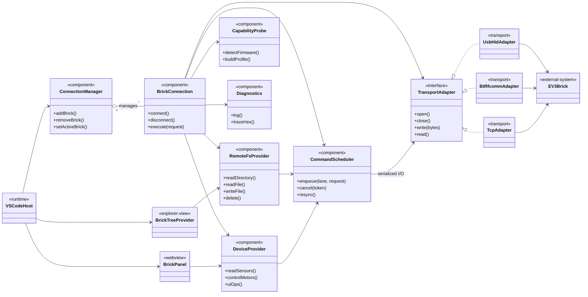
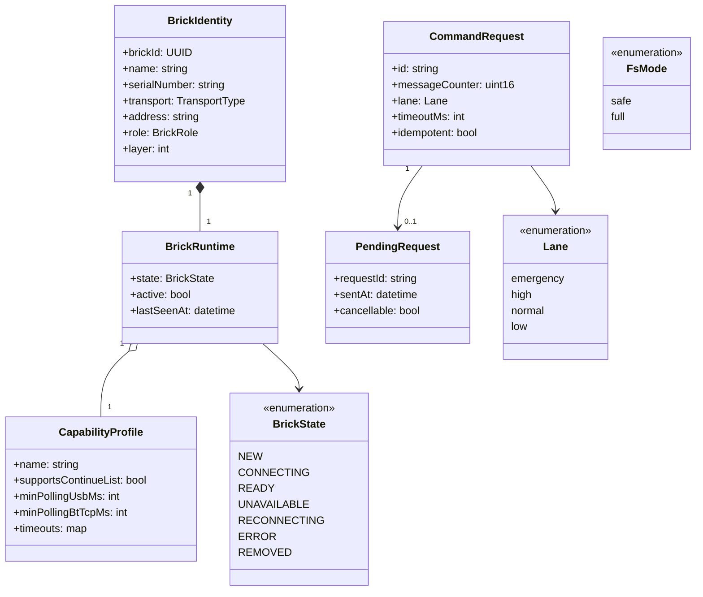
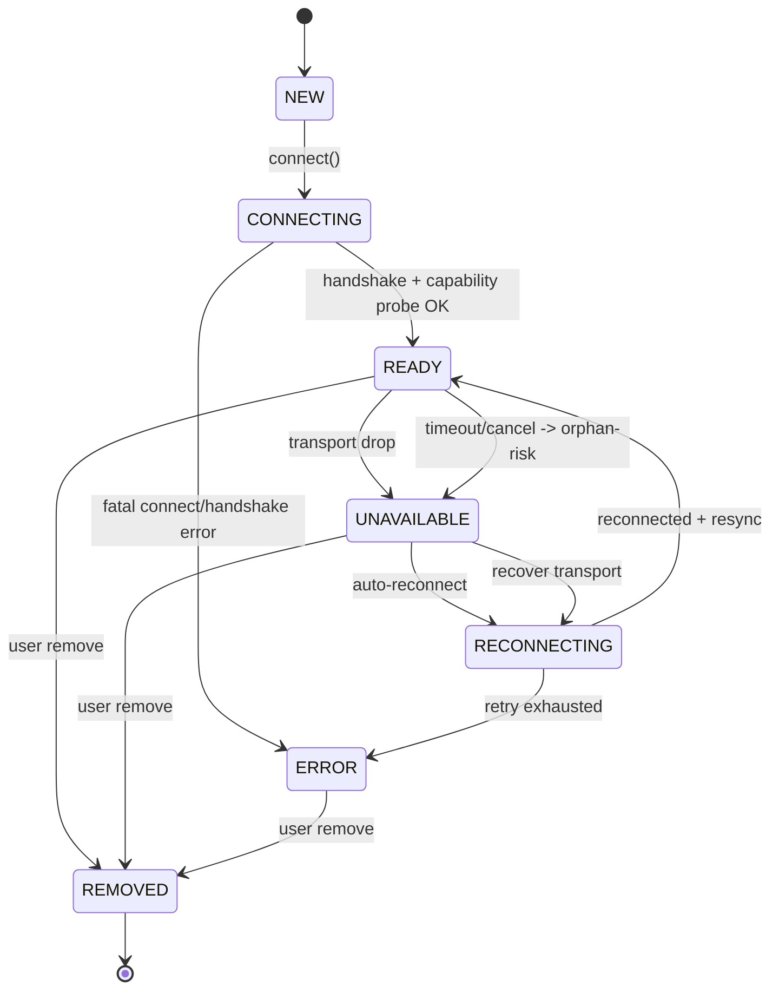
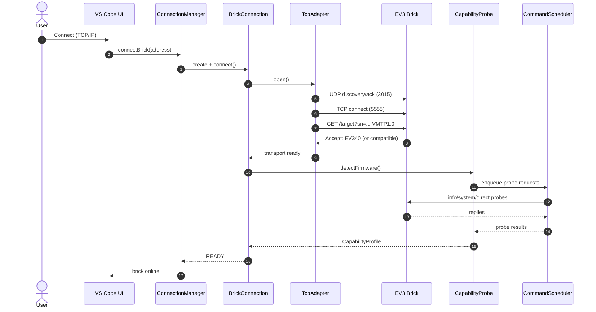
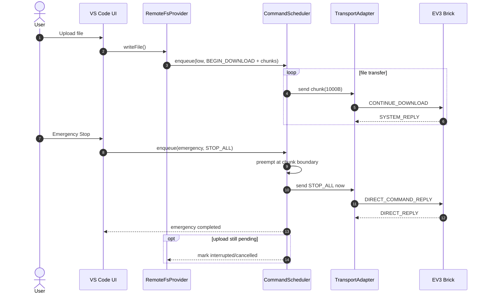
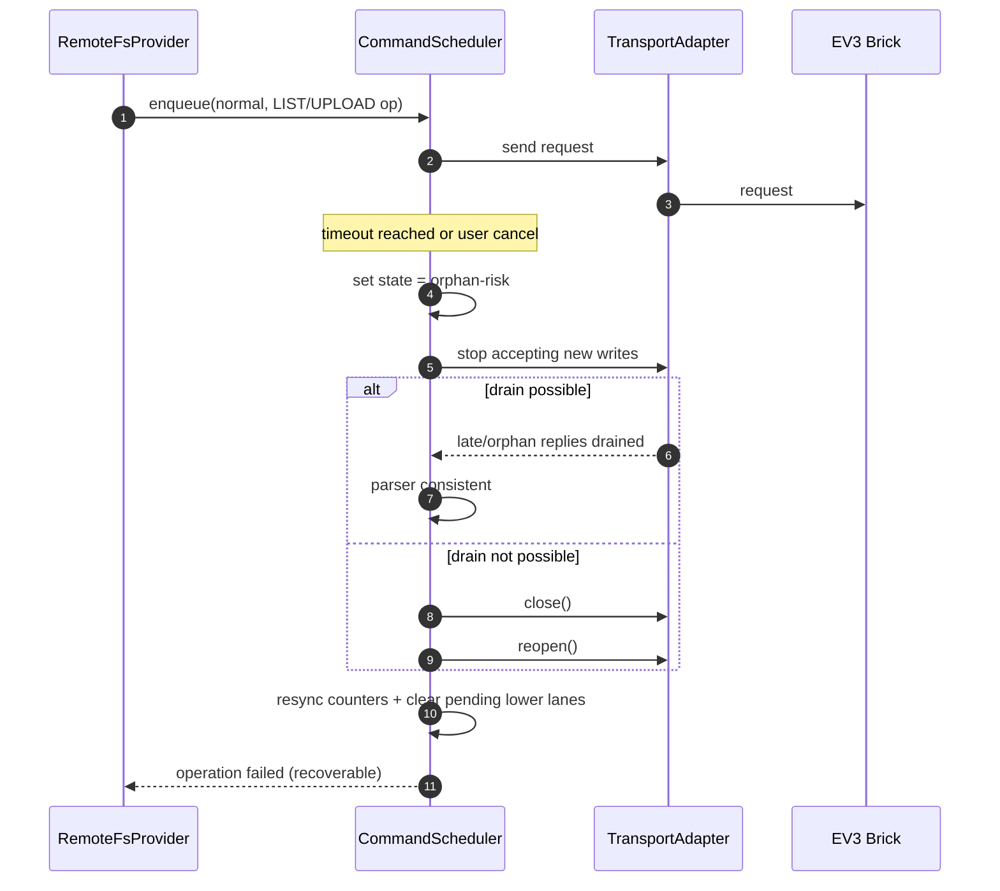
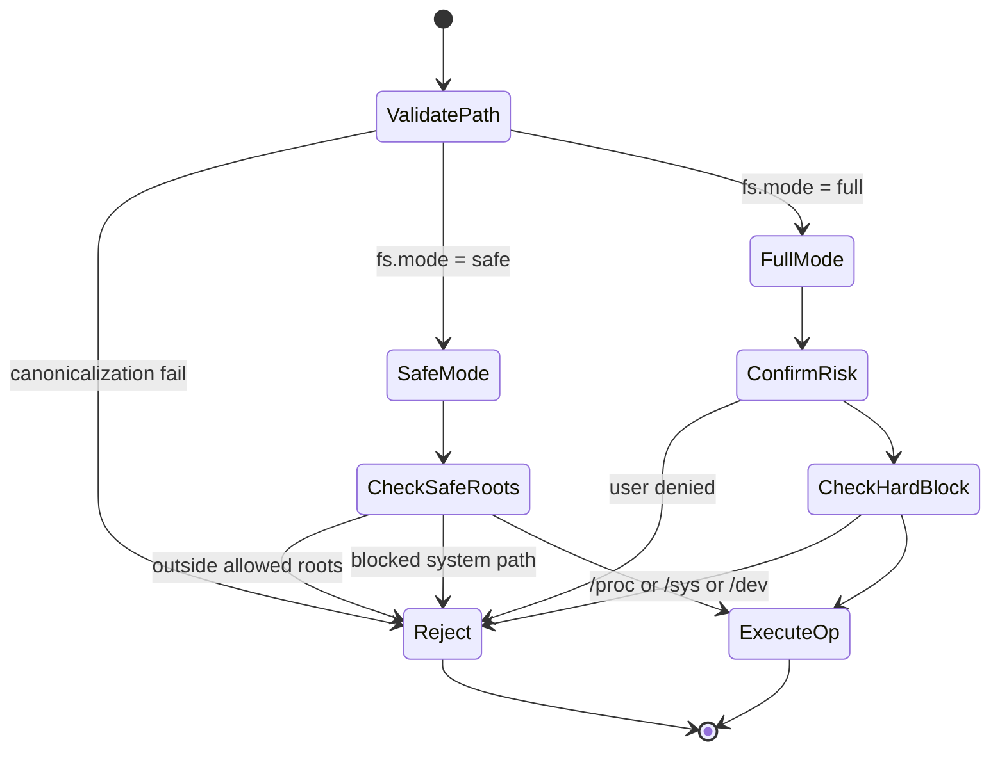

# EV3 Cockpit Architecture (Mermaid UML)

Tento dokument obsahuje UML diagramy pro `EV3 Cockpit` v Mermaid syntaxi.
Diagramy odpovidaji aktualnimu navrhu v `ev3-cockpit/DESIGN.md`.

## Obsah

1. Komponenty a hranice systemu
2. Domenovy model
3. Stavovy automat `BrickConnection`
4. Sekvence: TCP connect + capability probe
5. Sekvence: emergency preempce pri uploadu
6. Sekvence: timeout/cancel a orphan-risk recovery
7. Activity: Remote FS `safe`/`full` rezim

## 1) Komponenty a hranice systemu

## 2) Domenovy model

## 3) Stavovy automat `BrickConnection`

## 4) Sekvence: TCP connect + capability probe

## 5) Sekvence: emergency preempce pri uploadu

## 6) Sekvence: timeout/cancel a orphan-risk recovery

## 7) Activity: Remote FS `safe`/`full` rezim

