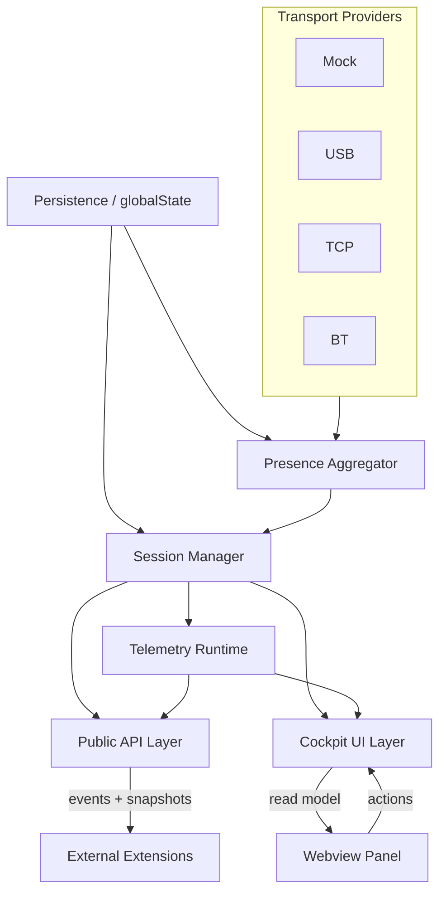
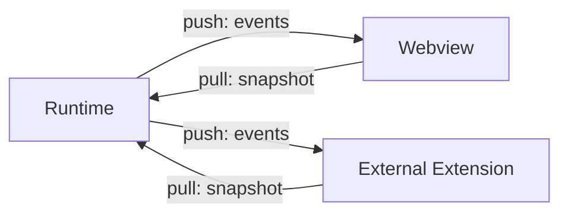
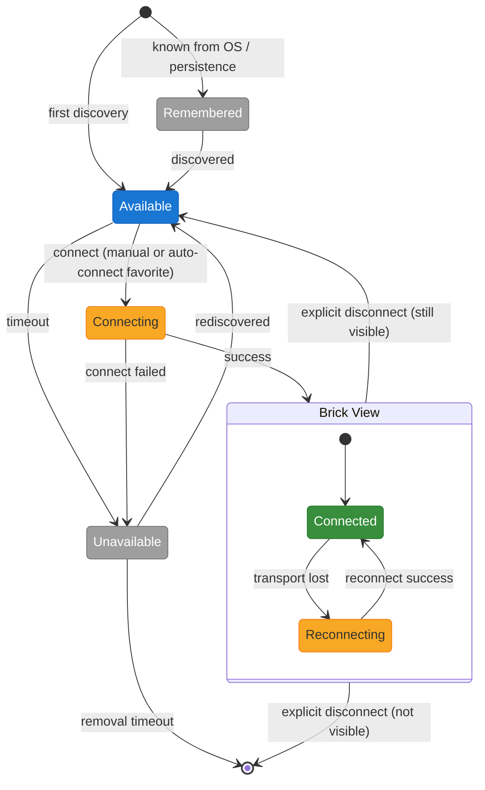
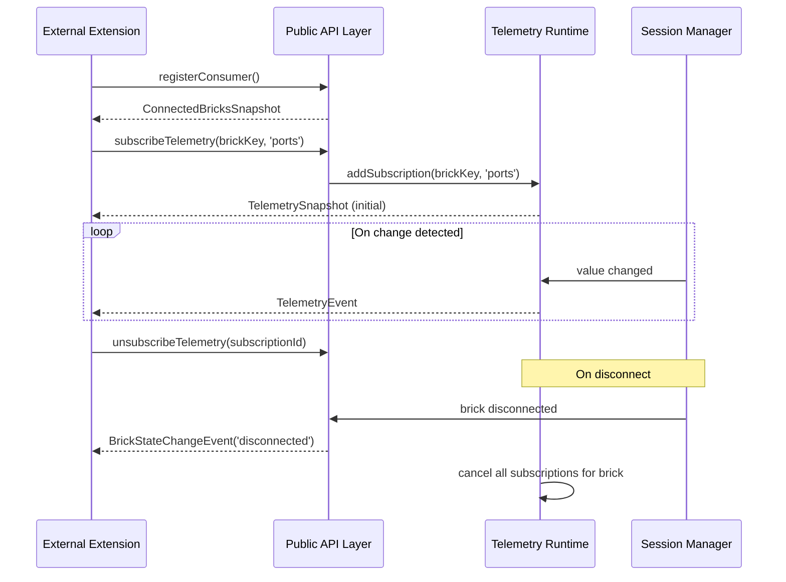

# EV3 Cockpit - Design

> Version: 2026-04-02
> Status: target design for new implementation
> Input: `REQUIREMENTS.md`

## 1. Design Goal

This document describes the target architecture of EV3 Cockpit so that it:

- meets the current requirements,
- can be re-implemented from a clean foundation,
- remains extensible for future versions.

## 2. Product Model

EV3 Cockpit has two primary roles:

- a panel UI for brick discovery, connection, and monitoring,
- a runtime and public API for other extensions.

Cockpit is the sole authority for physical `connect` and `disconnect`.
Other extensions do not communicate with bricks directly — they go through the exported Cockpit API.

### 2.1 Integration of Dependent Extensions

Dependent extensions access the Cockpit API via the standard VS Code mechanism:

- A dependent extension declares Cockpit in `extensionDependencies` in its `package.json`.
- VS Code installs and activates it only after Cockpit.
- The Cockpit API is obtained by calling `vscode.extensions.getExtension('ev3-cockpit')?.exports`.

Consequences:

- A dependent extension cannot be installed without Cockpit.
- A dependent extension will not start if Cockpit is not running.
- Cockpit guarantees that its API is initialized before any consumer begins using it.

## 3. Core Principles

### 3.1 Runtime Is the Source of Truth

The webview is not the source of truth about brick state.

The source of truth is the runtime layer, which manages:

- discovery,
- remembered bricks,
- connected sessions,
- the active brick,
- telemetry,
- the public API,
- metadata persistence.

### 3.2 One Foreground Brick

Cockpit can have at most one foreground brick at any time.

The foreground brick:

- is in the panel foreground,
- receives the fastest scan,
- provides the full read model for the Cockpit UI.

If the discovery tab is in the foreground or the panel is not visible, no brick is foreground.

### 3.3 Multiple Connected Sessions

Multiple bricks can be connected simultaneously.

Inactive connected bricks:

- stay connected,
- maintain heartbeat and reconnect,
- do not receive a foreground scan,
- may have subscription telemetry for other extensions.

### 3.4 Separation of Cockpit UX and API Telemetry

A clear distinction must be made between:

- Cockpit foreground telemetry for the active tab,
- subscription telemetry for other extensions,
- minimal telemetry for connected bricks without subscriptions.

This is a fundamental architectural rule. The active tab in the panel and API subscriptions are two separate things.

## 4. Architecture Layers

### 4.1 Transport Providers

Each transport implements a shared contract:

- `discover`,
- `connect`,
- `disconnect`,
- `send`,
- `recover`,
- `forget` where applicable.

Supported providers:

- `mock`,
- `usb`,
- `tcp`,
- `bt`.

### 4.2 Presence Aggregator

The Presence Aggregator unifies discovery output from all providers into a single discovery model.

Responsibilities:

- data normalization,
- `available / lost / removed` transitions,
- tracking of remembered devices,
- merging runtime information with persisted metadata,
- stable ordering of the discovery list.

### 4.3 Session Manager

The Session Manager manages physically connected bricks. It is the exclusive owner of the connection state.

Responsibilities:

- establishing sessions (via an internal API for the Cockpit UI),
- reconnect,
- heartbeat,
- explicit disconnect (via an internal API for the Cockpit UI),
- switching between `foreground / subscribed / minimal`.

The Public API is strictly read-only for session management; it cannot trigger `connect` or `disconnect`.

### 4.4 Telemetry Runtime

The Telemetry Runtime runs over a connected session and schedules individual telemetry loops.

Modes:

- `foreground`,
- `subscribed`,
- `minimal`.

Each mode has its own frequency and priority.

### 4.5 Adaptive Throttling

The speed of telemetry is governed by an **Adaptive Throttling** mechanism.

Goal:

- Cockpit foreground must remain responsive,
- the VS Code editor must not be blocked,
- subscription telemetry should be as fast as possible within the remaining capacity.

The throttling mechanism scales the frequency of requests based on:

- **Response latency**: how long the last command to the brick took to complete.
- **Queue depth**: how many commands are waiting in the per-brick queue.

The throttling applies to telemetry delivery scheduling only — it has no effect on user-facing UI logic or explicit commands.

The current telemetry speed is visible in the Cockpit panel (diagnostic display).

### 4.6 Public API Layer

The Public API layer exports:

- consumer registration,
- snapshot of connected bricks,
- state events,
- active brick,
- subscription telemetry,
- filesystem services.

### 4.7 Cockpit UI Layer

The Cockpit UI layer is a webview panel over runtime read models.

The UI:

- does not create its own brick state,
- only displays the read model and dispatches actions,
- must not contain domain logic for reconnects and lifecycle.

### 4.8 Communication Model

The runtime communicates with the webview and external extensions through a combined model:

Rules:

- **Push**: The runtime emits an event on every state or telemetry change. The webview and dependent extensions subscribe at initialization.
- **Pull**: The webview and dependent extensions can explicitly request a current snapshot at any time — for example after a webview restart or at first initialization.
- Within the runtime, layers communicate via direct calls or shared observable streams.
- Across a process boundary (to the webview or a dependent extension), communication is exclusively through events and snapshots.

## 5. Data Models

### 5.1 Discovery Item

One row in the discovery list represents one `brickKey`.

Minimum fields:

- `brickKey`,
- `displayName`,
- `transport`,
- `presenceState`,
- `remembered`,
- `connected`,
- `favorite`,
- `signalInfo?`,
- `availableTransports`,
- `btVisible?`,
- `lastSeenAt`.

`brickKey` is a stable internal identifier within a given transport. It must not depend on `displayName` (which is user-editable). Its primary purpose is stable ordering within a transport group — without a stable key, the brick order in the list would change on every discovery scan.

Transport-specific `brickKey` definitions:

- **USB**: Serial number (or VID:PID:Serial).
- **BT**: MAC address.
- **TCP**: IP address or mDNS hostname.
- **Mock**: Synthetic identifier from the JSON configuration (e.g., `mock:<id>` where `id` is defined in the config file).

### 5.2 Connected Session

Model of a connected session:

- `brickKey`,
- `displayName`,
- `transport`,
- `connectionState`,
- `activeMode`,
- `lastError?`,
- `subscribedCategories`,
- `heartbeatState`.

### 5.3 Active Brick View Model

Model for the foreground panel:

- brick identity,
- battery state,
- available transports,
- BT visibility if known,
- ports A–D and 1–4,
- peripheral types,
- current values,
- button state,
- system information for config mode,
- favorite state,
- preferred value display style,
- status bar configuration.

### 5.4 Public API Models

The API does not use UI models.

It requires its own explicit models:

- `ConnectedBrickSnapshot`,
- `BrickStateChangeEvent`,
- `ActiveBrickSnapshot`,
- `TelemetrySnapshot`,
- `TelemetryEvent`,
- `FilesystemEvent`.

## 6. State Model

### 6.1 Presence

Presence states:

- `remembered` — the system knows about the brick from OS evidence or Cockpit persistence, but the brick is not currently visible. It exists in the list as an offline entry.
- `available` — the brick is currently visible in discovery.
- `unavailable` — the brick was visible but has temporarily disappeared; the system waits for it to return.
- `removed` — the brick has disappeared definitively (timeout of `unavailable`); the record is discarded.

`remembered` and `removed` are equivalent from the user's perspective: the brick "does not exist". The difference is technical — `remembered` originates from evidence, `removed` from a timeout.

Rules:

- `available -> unavailable` after discovery timeout,
- `unavailable -> available` on rediscovery,
- `unavailable -> removed` after the removal timeout elapses,
- a `remembered` entry may exist without a prior `available` in the current session.

**Auto-connect:**

A brick marked as `favorite` is automatically connected on transition from "non-existent" to `available`. This includes:

- first discovery in a new session (`remembered -> available` or `[*] -> available`),
- rediscovery within a session (`removed -> available`).

After an explicit disconnect, auto-connect for that brick is suppressed for the rest of the current session — it will not re-trigger even if the brick disappears and reappears.

### 6.2 Connection

Connected session states:

- `connecting`,
- `connected`,
- `reconnecting`,
- `disconnected`.

Rules:

- only Cockpit creates sessions via `connect`,
- a transport failure leads to `reconnecting`,
- explicit `disconnect` terminates the session regardless of active subscriptions,
- on explicit disconnect, subscription registries for that brick are cleared.

After explicit disconnect:

- if the brick is still visible in discovery → it transitions to `available`,
- if not visible → it transitions to `removed`.

### 6.3 Activity

Session activity is a separate dimension:

- `foreground`,
- `subscribed`,
- `minimal`,
- `none`.

Transitions:

- at most one session can be `foreground`,
- multiple sessions can be `subscribed`,
- `minimal` means heartbeat without extended telemetry,
- `none` occurs after disconnect.

### 6.4 State Diagram

## 7. Discovery and Remembered Bricks

### 7.1 Discovery List

The discovery tab displays a single unified list of:

- available bricks,
- connected bricks,
- remembered bricks that are out of reach.

Each item stays in the list according to its current state. The UI works with a single read model, not several separate lists.

### 7.2 Ordering

Primary groups:

1. `mock`
2. `usb`
3. `tcp`
4. `bt`

Within a group:

- by `signalInfo` where it exists and is meaningful,
- otherwise by stable `brickKey`,
- never by user-editable `displayName`.

### 7.3 Forget Action

A remembered brick may have a trash action.

Implementation model:

- an OS-specific adapter performs the unpairing or removal from local evidence,
- Cockpit simultaneously removes local persisted metadata (including `favorite`),
- forgetting is only permitted where the provider can safely perform it.

## 8. Favorites and Persistence

### 8.1 Persistence Location

Cockpit metadata is stored in the standard per-user VS Code extension storage (`ExtensionContext.globalState`).

Reasons:

- it is the natural cross-platform storage,
- it requires no direct work with the registry or a custom per-user database,
- it binds naturally to the extension lifecycle.

OS-specific evidence such as BT pairing remains outside this storage and is read through the provider.

### 8.2 Favorite Rules

Persisted per-brick metadata includes at minimum:

- `favorite`,
- preferred visual style for measured values (`numeric` / `visual`),
- status bar configuration,
- remembered UI metadata.

Rules:

- `star toggle` is available only in the status bar of the connected brick tab — clicking the star toggles `favorite`,
- in the discovery list, the star only indicates state and is not clickable,
- in config mode, the star is not available,
- the trash icon in the discovery list deletes all stored metadata for the brick including `favorite` — this is a deletion, not a toggle.

## 9. Telemetry Design

### 9.1 Categories

Telemetry is divided into categories:

- `ports` — sensors, motors, port mapping, and measured values,
- `filesystem` — filesystem state and events relevant to the API consumer,
- `system` — system information: firmware, battery, available transports.

Categories are an explicit part of the public API and internal scheduling. A dependent extension subscribes only to the categories it needs.

### 9.2 Foreground Telemetry

Foreground telemetry is for the active brick in the panel only.

Contains:

- port mapping,
- peripheral detection,
- live values,
- button state,
- battery,
- system data needed for the status bar and config mode.

### 9.3 Subscribed Telemetry

Subscribed telemetry runs over an inactive connected brick only when an active API subscription exists.

Rules:

- subscriptions are per category,
- a snapshot is always delivered before events,
- after a subscription ends, the runtime may hold the last snapshot briefly as `stale`,
- subscribed telemetry is slower than foreground.

### 9.4 Minimal Telemetry

Minimal telemetry is the base mode of a connected brick without foreground and without subscriptions.

Contains only:

- heartbeat,
- reconnect state,
- session availability.

### 9.5 Adaptive Throttling

The speed of subscription telemetry is governed by the Adaptive Throttling mechanism described in §4.5.

The throttling applies to telemetry delivery scheduling only — it has no effect on user-facing UI logic or explicit commands.

The current telemetry speed is visible in the Cockpit panel (diagnostic display).

### 9.6 Telemetry Subscription Flow

## 10. Public API Design

### 10.1 Entry Model

A dependent extension:

1. declares Cockpit in `extensionDependencies` and after activation calls `vscode.extensions.getExtension('ev3-cockpit')?.exports`,
2. registers as a consumer,
3. receives a snapshot of connected bricks,
4. subscribes to state change callbacks,
5. optionally creates telemetry subscriptions.

### 10.2 What the API Exports

The first version of the public API exports:

- `registerConsumer`,
- `unregisterConsumer`,
- `getConnectedBricks`,
- `onBrickStateChanged`,
- `getActiveBrick`,
- `onActiveBrickChanged`,
- `subscribeTelemetry`,
- `unsubscribeTelemetry`,
- filesystem operations.

### 10.3 What the API Does Not Export

The public API intentionally does not export:

- physical `connect`,
- physical `disconnect`,
- direct access to the discovery list of unconnected bricks.

This keeps responsibility for the session lifecycle in one place.

## 11. Filesystem Design

The Cockpit UI will not contain a file explorer or browse workflow.

The filesystem is designed as a service for API consumers.

The first version provides:

- `uploadFile`,
- `downloadFile`,
- `executeRbf`,
- basic read/list operations over an explicit `folder` and `file`.

More extensive deployment workflows (e.g. full-folder sync) are deferred to a later version.

## 12. Cockpit UI Design

The primary users include children from approximately age 10 (see `REQUIREMENTS.md §2`). The UX must be clear and self-explanatory in its basic mode. Advanced features are exposed through settings and configuration mode, not through a separate interface.

### 12.1 Discovery Tab

The discovery tab is the main entry point into Cockpit.

Each row contains:

- a transport icon,
- a color-coded status,
- a name,
- supplementary icons on the right according to state.

Quick actions:

- connect for an available brick,
- focus/open for a connected brick,
- trash for a remembered offline brick (removes all metadata including `favorite`),
- signal indication where available,
- star for a brick with `favorite: true` (indication, not a toggle).

### 12.2 Brick Tab

Each connected brick has its own tab.

**Tab header:**

- transport icon with status color,
- brick name,
- gear icon for config mode,
- X icon for explicit disconnect.

**Status bar** (top row inside the tab):

- left: icons of available transports for the brick (not necessarily the one it is connected through),
- center: battery state,
- right: star — **clickable**, toggles `favorite` on/off; shown only when `favorite: true`.

**Tab content — normal mode:**

- brick image with interactive buttons,
- above the brick: 4 motor ports (A, B, C, D),
- below the brick: 4 sensor ports (1, 2, 3, 4),
- each port shows a peripheral icon and a measured value.

**Measured value visual style** (configurable per brick, stored with `favorite`):

- **Numeric style**: the exact text value as returned by the sensor.
- **Visual style**: each peripheral type has its own graphical element — a color sensor shows a color target, a touch sensor shows press state, a gyro shows an arc with an indicator, an ultrasonic sensor shows a distance bar, a motor shows schematic rotation, etc. Visual inspiration: makecode.mindstorms.com.

Switching the style is done in config mode and the preference is persisted.

### 12.3 Config Mode

Config mode is part of the same tab — it replaces the normal mode content.

Displays:

- editable brick name,
- system and technical information,
- toggle for the measured value visual style (`numeric` / `visual`),
- status bar configuration.

**Auto-save and Optimistic Updates**: After each edit action (keystroke, checkbox toggle, etc.), a timer starts for that specific field. The change is written to the brick on focus loss or after 1 second from the last action.
- **Optimistic Update**: The Session Manager immediately emits a local event with the new value so the UI and Public API reflect the change instantly.
- **Telemetry Confirmation**: The final source of truth remains the physical brick. Telemetry eventually confirms whether the change was successful or if the value has changed externally (e.g., physically on the brick).

**The star toggle is not available in config mode.**

**Sensor and motor port state is not displayed in config mode.** The brick image with ports is replaced by the configuration form. System information fields (such as brick name) remain live — if a value changes externally, it updates in the form.

## 13. Mock Design

Mock is an equal transport provider.

### 13.1 Mock Runtime

The mock runtime must implement the same contract as physical transports:

- discovery,
- connect,
- reconnect,
- telemetry,
- filesystem API,
- error states.

### 13.2 Mock Configuration

Mock brick definitions are loaded from a JSON configuration file in the workspace.

The format must support:

- brick identity and system parameters,
- connected sensors and motors,
- value dynamics (static values or oscillators).

A GUI editor for this configuration is deferred — see `REQUIREMENTS.md §16`.

## 14. Commands and VS Code Integration

The primary UX is in the panel.

The Command Palette serves only as:

- a fallback,
- diagnostics,
- emergency panel recovery.

Commands can be added or removed in future versions. The design must not rely on them as the primary mode of interaction.

## 15. Non-Functional Requirements

### 15.1 Performance

Cockpit must not significantly degrade the VS Code experience.

Requirements:

- tab switching must remain smooth,
- the text editor must not be blocked,
- webview refresh must be limited,
- separate frequencies for `foreground / subscribed / minimal`.

The system must handle dozens of simultaneously visible devices (as required by `REQUIREMENTS.md §5`). This implies:

- the Presence Aggregator must handle frequent discovery updates without blocking,
- the discovery list UI must render efficiently (consider virtual scrolling for large lists),
- telemetry scheduling must scale with the number of connected bricks without degrading the foreground experience.

### 15.2 Stability

A connected session is more valuable than a transient discovery record.

This means:

- reconnect is preferred over losing a session,
- explicit disconnect takes precedence,
- a failure of one brick must not destabilize other sessions.

**Command queue:**

- each connected brick has its own communication queue,
- the queue is shared across all transport providers for that brick — if a brick is connected via both USB and BT simultaneously, they share one queue,
- this architecture prevents conflicts between transport layers over the same brick.

## 16. Deferred and Maybe Someday

See `REQUIREMENTS.md §4` (deferred to a later version) and `REQUIREMENTS.md §16` (maybe someday). The architecture must not block any of those areas.
