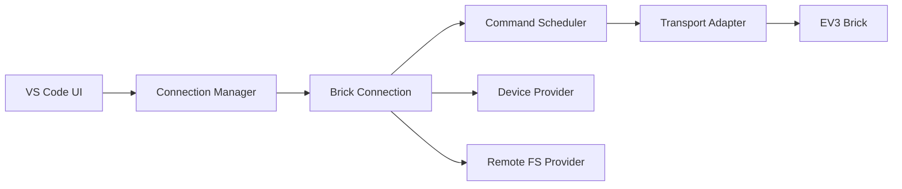
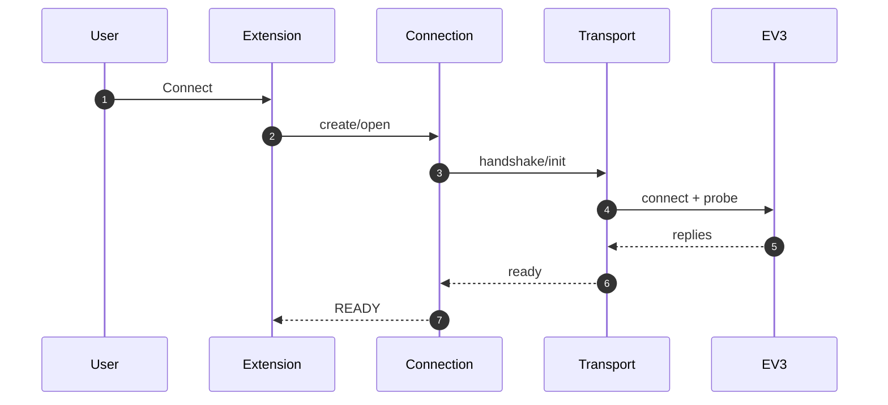

# EV3 Cockpit

VS Code extension for connecting and controlling LEGO Mindstorms EV3 via ev3dev.

## Architecture (Quick View)

Detailed UML diagrams are available in `architecture.md`.

### High-level Components



### Connect Flow (TCP/BT/USB)



## Development

```bash
npm install
npm run clean
npm run compile
```

Press **F5** in VS Code to launch the Extension Development Host.

Workspace default transport for development is set to USB in `.vscode/settings.json`:

```json
{
  "ev3-cockpit.transport.mode": "usb"
}
```

Override it in workspace/user settings when you need `bluetooth` or `tcp` test runs.

## Test Categories

- `npm test` or `npm run test:unit` - compile + unit/integration tests without physical EV3 hardware.
- `npm run test:host` - extension-host category (`[HOST]`) in real VS Code process:
  - extension activation + command registration,
  - non-interactive command execution without hardware (`inspectTransports`, `browseRemoteFs`),
  - `ev3://` provider offline behavior,
  - mock connect flow wiring (`ev3-cockpit.transport.mode=mock`) for active provider path,
  - fake TCP EV3 end-to-end provider flow (`ev3://active/...` read/write/copy/rename/delete, recursive directory operations, safe-root enforcement) without physical hardware,
  - workspace deploy command e2e flow against fake TCP EV3 (`previewWorkspaceDeploy` no-write validation, `deployWorkspace` upload validation, `deployWorkspaceAndRunRbf` upload+run validation).
- `npm run test:hw` - hardware smoke category (`[HW]`) in fixed order: USB -> TCP (WiFi) -> Bluetooth.
- `npm run test:hw:matrix` - hardware matrix category (`[HW-MATRIX]`) that runs multiple hardware-smoke scenarios (`baseline`, `reconnect`, `reconnect-glitch`) and writes JSON report artifact.
- `npm run test:hw:all` - `test:hw` followed by `test:hw:matrix`.
- `npm run test:all` - unit + extension-host + hardware categories.

## CI

- `.github/workflows/ci.yml` runs required pipeline on push/PR: `lint`, `test` (unit), `test:host`.
- `.github/workflows/hardware.yml` is manual (`workflow_dispatch`) optional hardware pipeline that runs `test:hw` and `test:hw:matrix` and uploads logs/reports as artifacts.

Hardware smoke returns explicit status per transport:
- `PASS` transport tested successfully.
- `SKIP` transport not available in current environment (for example no USB EV3 detected).
- `FAIL` transport was available but probe/capability check failed.

Optional hardware env vars:
- `EV3_COCKPIT_HW_TIMEOUT_MS`, `EV3_COCKPIT_HW_USB_PATH`
- `EV3_COCKPIT_HW_TRANSPORTS` (optional): comma-separated transport subset for hardware smoke, for example `usb,tcp` to skip Bluetooth.
- `EV3_COCKPIT_HW_MATRIX_SCENARIOS` (optional): comma-separated hardware matrix scenarios (`baseline,reconnect,reconnect-glitch,driver-drop`).
- `EV3_COCKPIT_HW_MATRIX_REPORT` (optional): output path for matrix JSON report (default `artifacts/hw/hardware-matrix.json`).
- `EV3_COCKPIT_HW_EMERGENCY_STOP_CHECK` (optional, default `true`): include emergency-stop validation (`PROGRAM_STOP` + `OUTPUT_STOP`) in hardware smoke.
- `EV3_COCKPIT_HW_RECONNECT_CHECK` (optional, default `false`): include disconnect/reconnect recovery scenario (open -> probe -> close -> reopen -> probe) for selected transports (`usb|tcp|bluetooth`).
- `EV3_COCKPIT_HW_RECONNECT_GLITCH_CHECK` (optional, default `true`): when reconnect check is enabled, include simulated in-flight disconnect recovery (close during pending probe -> reopen -> probe) for `usb|bluetooth`.
- `EV3_COCKPIT_HW_RECONNECT_DRIVER_DROP_CHECK` (optional, default `false`): when reconnect check is enabled, run manual real driver-drop scenario for `usb|tcp|bluetooth` (physical disconnect/reconnect within time window).
- `EV3_COCKPIT_HW_RECONNECT_DRIVER_DROP_WINDOW_MS`, `EV3_COCKPIT_HW_RECONNECT_DRIVER_DROP_POLL_MS`: timing controls for driver-drop reconnect scenario.

For matrix runs, `driver-drop` is opt-in (not in default scenario list) because it requires manual physical interaction.
- `EV3_COCKPIT_HW_TCP_HOST`, `EV3_COCKPIT_HW_TCP_USE_DISCOVERY`, `EV3_COCKPIT_HW_TCP_DISCOVERY_TIMEOUT_MS`, `EV3_COCKPIT_HW_TCP_ATTEMPTS`, `EV3_COCKPIT_HW_TCP_RETRY_DELAY_MS`
- `EV3_COCKPIT_HW_BT_PORT`, `EV3_COCKPIT_HW_BT_PROBE_TIMEOUT_MS`, `EV3_COCKPIT_HW_BT_PORT_ATTEMPTS`, `EV3_COCKPIT_HW_BT_RETRY_DELAY_MS`, `EV3_COCKPIT_HW_BT_DTR`
- `EV3_COCKPIT_HW_RUN_RBF_PATH` (optional): run an already existing remote `.rbf` path (supports `ev3://active/...` too).
- `EV3_COCKPIT_HW_RUN_RBF_FIXTURE` (optional): local `.rbf` fixture path. Use `auto` to use embedded `Empty.rbf` bytes from source (`src/hw/fixtures/emptyProgram.ts`).
- `EV3_COCKPIT_HW_RUN_RBF_REMOTE_PATH` (optional): remote upload destination for fixture mode (default `/home/root/lms2012/prjs/ev3-cockpit-hw-run-fixture.rbf`).

When `EV3_COCKPIT_HW_RUN_RBF_FIXTURE` is set, hardware smoke performs a real lifecycle test:
`upload fixture -> run program -> delete uploaded file`.

## Commands

- `EV3 Cockpit: Connect to EV3 Brick` — connect to EV3 brick
- `EV3 Cockpit: Deploy and Run .rbf (active)` — pick a local `.rbf`, upload to active EV3 default root and start it
- `EV3 Cockpit: Preview Deploy Changes (active)` — pick a local folder and preview upload/skip/cleanup result without modifying EV3
- `EV3 Cockpit: Sync Project to EV3 (active)` — pick a local folder and upload/sync project tree to active EV3 (without starting program)
- `EV3 Cockpit: Preview Workspace Deploy Changes (active)` — preview deploy changes for current workspace folder directly (or choose one in multi-root workspace)
- `EV3 Cockpit: Sync Workspace to EV3 (active)` — sync current workspace folder directly (or choose one in multi-root workspace) without folder dialog
- `EV3 Cockpit: Deploy Project and Run .rbf (active)` — pick a local folder, upload project tree to EV3 and run selected `.rbf`
- `EV3 Cockpit: Deploy Workspace and Run .rbf (active)` — deploy workspace folder directly (or choose one in multi-root workspace) and run selected `.rbf`
- `EV3 Cockpit: Apply Deploy Profile` — quickly apply preset deploy configuration (`Safe Sync`, `Atomic Sync`, `Full Sync`)
- `EV3 Cockpit: Run Remote Program (.rbf)` — run a chosen remote `.rbf` path (`/path/file.rbf` or `ev3://active/...`)
- `EV3 Cockpit: Stop Program (active)` — send `PROGRAM_STOP` for active VM slot
- `EV3 Cockpit: Restart Program (active)` — stop current program and run last/selected `.rbf` again
- `EV3 Cockpit: Reconnect EV3 (active settings)` — re-run full connect probe/capability flow using current transport settings
- `EV3 Cockpit: Disconnect EV3 (active)` — close active session and clear in-memory EV3 services
- `EV3 Cockpit: Emergency Stop (active)` — sends emergency lane stop command (`PROGRAM_STOP` + `OUTPUT_STOP`) to active connection
- `EV3 Cockpit: Inspect Transport Candidates` — show USB/serial discovery snapshot
- `EV3 Cockpit: Transport Health Report` — run probe+capability checks over USB/TCP/Bluetooth and print PASS/SKIP/FAIL summary
- `EV3 Cockpit: Browse Remote FS (active)` — interactive browser for `ev3://active/...` with actions:
  - upload file(s) to current folder,
  - create folder,
  - delete file/folder,
  - open/download binary files (`Open Preview` / `Download to Local...`),
  - run `.rbf` program directly on EV3 (`Run on EV3`).

## Config Notes

- `ev3-cockpit.compat.profile`: `auto` or `stock-strict`
- `ev3-cockpit.fs.mode`: `safe` (default) or `full`
- `ev3-cockpit.fs.defaultRoots`: safe mode allowed roots (default `/home/root/lms2012/prjs/`, `/media/card/`)
- `ev3-cockpit.fs.fullMode.confirmationRequired`: UX guard for risky full FS access
- `ev3-cockpit.deploy.excludeDirectories`: directories skipped by project deploy recursion (default `.git`, `node_modules`, `.vscode-test`, `out`)
- `ev3-cockpit.deploy.excludeExtensions`: file extensions skipped by project deploy (default `.map`)
- `ev3-cockpit.deploy.includeGlobs`: file globs included in deploy scan (default `["**/*"]`)
- `ev3-cockpit.deploy.excludeGlobs`: file globs excluded after include matching (default `[]`)
- `ev3-cockpit.deploy.maxFileBytes`: max allowed file size per uploaded file in project deploy (default `5242880`)
- `ev3-cockpit.deploy.incremental.enabled`: upload only changed project files by remote md5/size comparison (default `false`)
- `ev3-cockpit.deploy.cleanup.enabled`: delete stale remote files/directories missing from local project after deploy (default `false`)
- `ev3-cockpit.deploy.cleanup.confirmBeforeDelete`: require modal confirmation before cleanup deletes stale remote entries (default `true`)
- `ev3-cockpit.deploy.cleanup.dryRun`: preview stale remote files/directories without deleting them (default `false`)
- `ev3-cockpit.deploy.atomic.enabled`: stage project to temporary remote root and swap with rollback semantics (default `false`)
- `ev3-cockpit.deploy.verifyAfterUpload`: post-upload integrity verification mode (`none`/`size`/`md5`, default `none`)
- `ev3-cockpit.deploy.conflictPolicy`: behavior when remote file already exists (`overwrite`/`skip`/`ask`, default `overwrite`)
- `ev3-cockpit.deploy.conflictAskFallback`: fallback behavior for `conflictPolicy=ask` (`prompt`/`skip`/`overwrite`, default `prompt`)
- `ev3-cockpit.deploy.resilience.enabled`: enable retry/reconnect handling for transient transport deploy failures (default `true`)
- `ev3-cockpit.deploy.resilience.maxRetries`: max additional retries per deploy step when resilience is enabled (default `1`)
- `ev3-cockpit.deploy.resilience.retryDelayMs`: delay between deploy resilience retries in milliseconds (default `300`)
- `ev3-cockpit.deploy.resilience.reopenConnection`: perform `close/open` reconnect before retrying failed deploy step (default `true`)

Runtime keeps in-memory program session metadata (last path, start timestamp, source command, transport mode) and uses it for restart and diagnostics output.

Remote filesystem URI scheme is `ev3://<brickId>/<abs_path>`. Current MVP uses `ev3://active/...` for the active connection.
After connecting, you can open files via Quick Open with paths like `ev3://active/home/root/lms2012/prjs/your-file.txt`.
For directory navigation use command `EV3 Cockpit: Browse Remote FS (active)`.
When switching `ev3-cockpit.fs.mode` to `full` and confirmation is enabled, extension asks for explicit confirmation and reverts to `safe` if declined.
